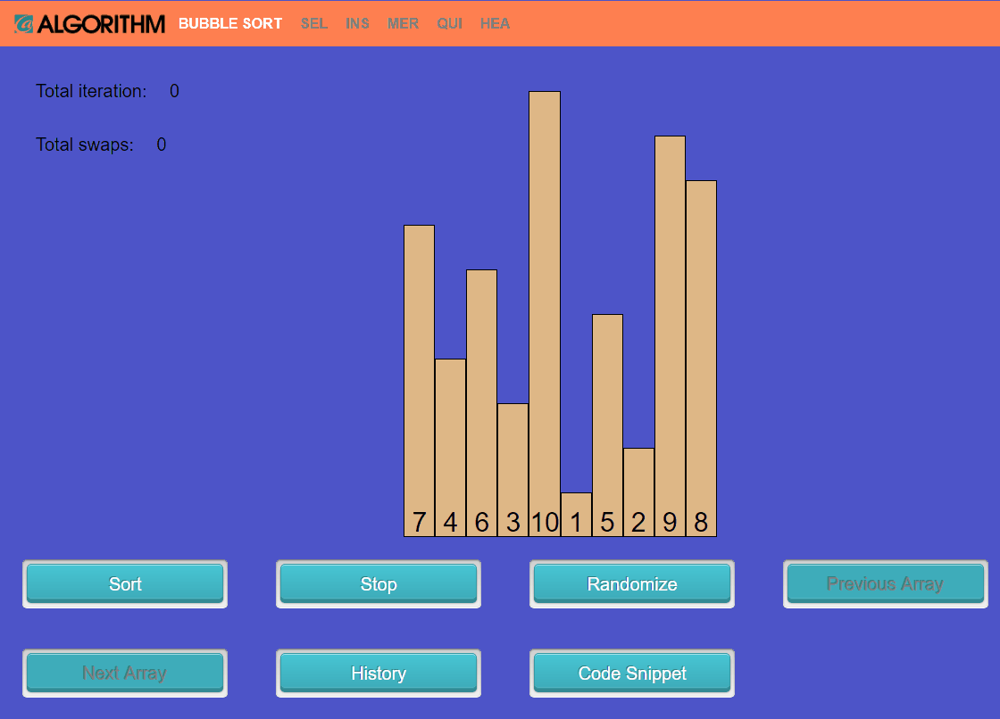
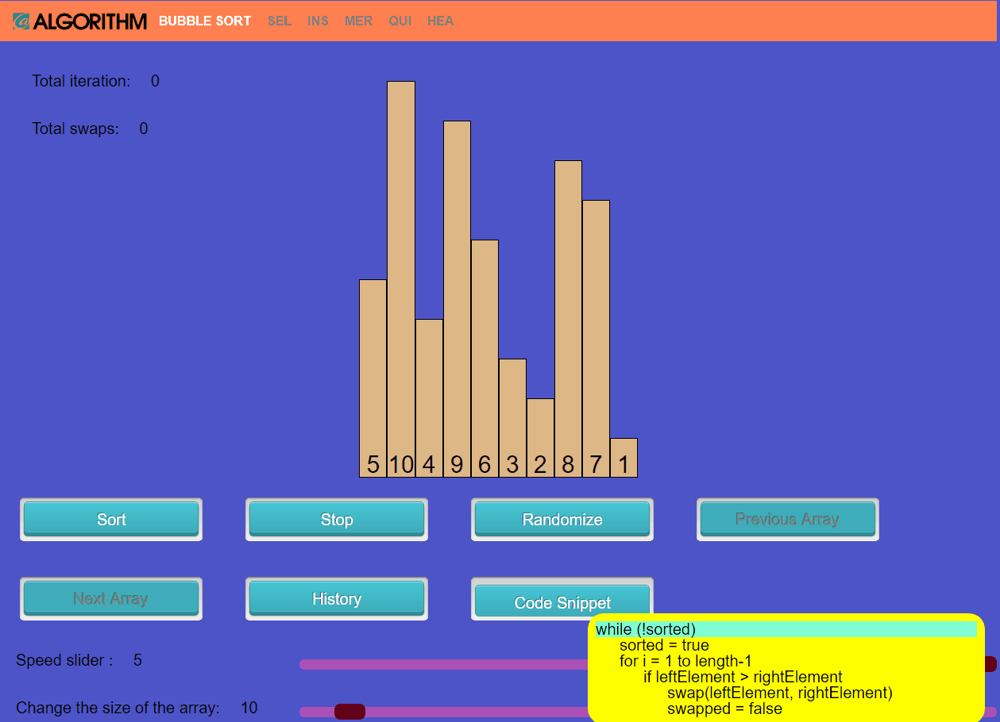
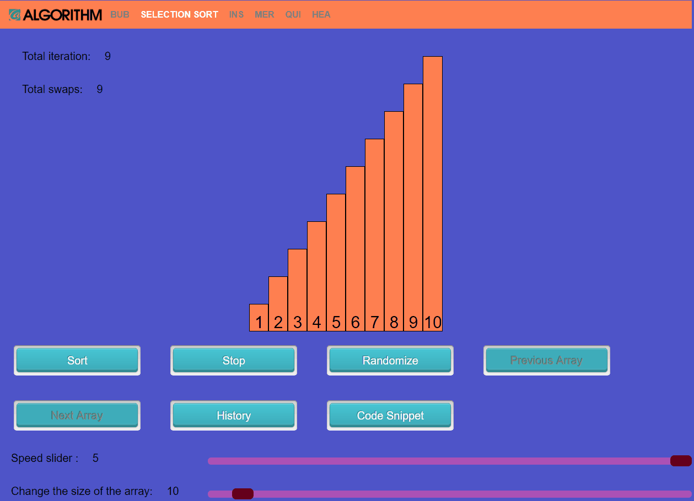
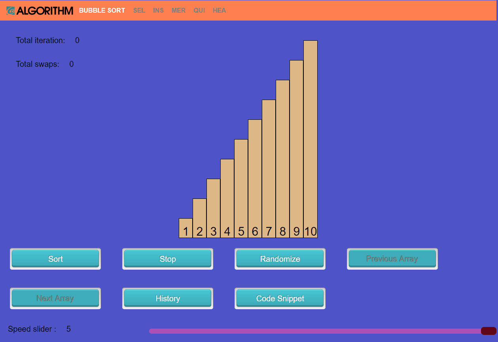
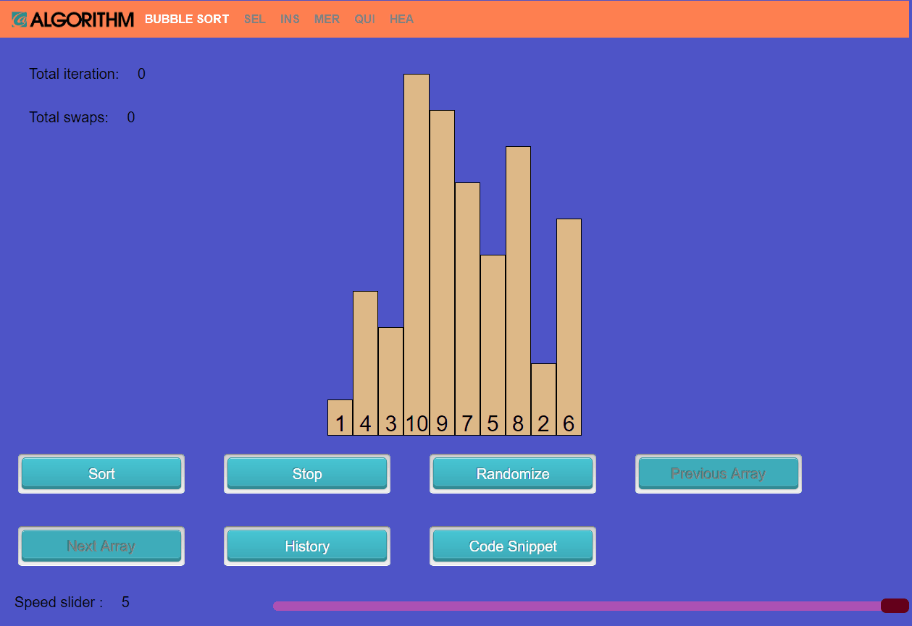

# Alrogithm Visualizer

A visualizer that shows the process of the sorting algorithmgs

[Live Demo](https://yuichiu416.github.io/Alrogithm_visualizer/)

## Functionaliy and MVP
1. Shows the algorithm step by step
   
2. Able to select different algorithms
   
3. Code snippet as it runs
   
4. Customized input size
      
5. Selected previous inputs if necessary
   
6. Change the speed if necessary
   

## Technologies
1. JavaScript
2. HTML
3. CSS

## Technical Challenges
1. Visualize the array in histogram
2. Colorize the array if necessary
3. Combine algorithms with html/css
   
## Code snippet example